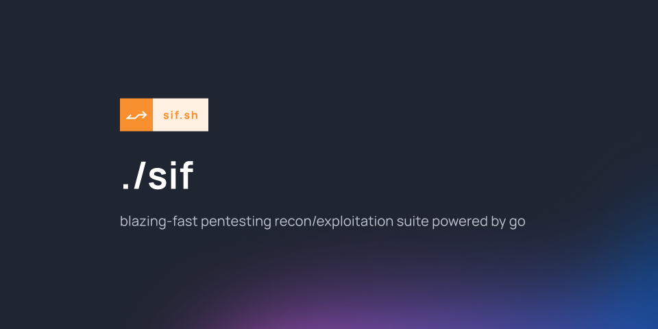

<div align="center">



<br><br>

[](https://go.dev/)
[](https://github.com/vmfunc/sif/actions)
[](LICENSE)
[](https://aur.archlinux.org/packages/sif)
[](https://search.nixos.org/packages?query=sif)
[](https://github.com/vmfunc/homebrew-sif)
[](https://cloudsmith.io/~sif/repos/deb/packages/)
[](https://discord.gg/Yksy9J2BvE)

**[install](#install) · [usage](#usage) · [modules](#modules) · [docs](docs/) · [contribute](#contribute)**

*fast, concurrent recon to exploitation in one binary. every scanner shares one connection-pooled http client.*

</div>

---

## what is sif?

sif is a recon and exploitation scanner that runs the whole chain in one binary: subdomain enum, port scan, crawler, nuclei, framework/cve detection, js secret extraction, web-vuln probes (cors/xss/redirect), cloud and takeover checks. 25+ scan types, one command.

```bash
sif -u https://example.com -dnslist -ports -crawl -js -framework -nuclei
```

nuclei and colly are compiled in as libraries rather than shelled out to (there's no `exec.Command` in the tree), so it's a single static binary with no runtime dependencies and nothing to wire together.

every scanner runs through one shared http client and a work-stealing worker pool. `-proxy`, `-H`, `-cookie` and `-rate-limit` apply to the whole run at once, connections get pooled and reused across the scan (a single-host run reuses one connection for ~50 requests instead of dialing 50 times), and a slow host doesn't hold the rest up. that shared client is the practical reason to use it over piping a stack of separate tools together. port scanning is `connect()`-based, so rustscan and nmap are still faster at raw port scans.

it reads targets from stdin and prints findings one per line under `-silent`, so it composes:

```bash
subfinder -d example.com | sif -silent -crawl -js -nuclei | notify
```

`-diff` turns a re-scan into a monitor that only reports what changed, `-notify` posts to slack/discord/telegram/webhook, and runs export to sarif and markdown.

## install

### homebrew (macos)

```bash
brew tap vmfunc/sif
brew install sif
```

### arch linux (aur)

install using your preferred aur helper:

```bash
yay -S sif
# or
paru -S sif
```

### nix

```bash
# nixpkgs (declarative: add to configuration.nix or home-manager)
environment.systemPackages = [ pkgs.sif ];

# or imperatively
nix profile install nixpkgs#sif

# or just run it without installing
nix run nixpkgs#sif -- -u https://example.com -headers -sh -framework
```

the repo also ships a flake if you want to build from source:

```bash
nix run github:vmfunc/sif
```

### debian/ubuntu (apt)

```bash
curl -1sLf 'https://dl.cloudsmith.io/public/sif/deb/setup.deb.sh' | sudo -E bash
sudo apt-get install sif
```

### from releases

grab the latest binary from [releases](https://github.com/vmfunc/sif/releases).

### from source

```bash
git clone https://github.com/vmfunc/sif.git
cd sif
make
```

requires go 1.25+

### aur (manual install)

```bash
git clone https://aur.archlinux.org/sif.git
cd sif
makepkg -si
```

## usage

```bash
# basic scan
./sif -u https://example.com

# directory fuzzing
./sif -u https://example.com -dirlist medium

# subdomain enumeration
./sif -u https://example.com -dnslist medium

# port scanning
./sif -u https://example.com -ports common

# javascript framework detection + cloud misconfig
./sif -u https://example.com -js -c3

# shodan host intelligence (requires SHODAN_API_KEY env var)
./sif -u https://example.com -shodan

# securitytrails domain discovery (requires SECURITYTRAILS_API_KEY env var)
# discovers subdomains + associated domains, then scans all of them
./sif -u https://example.com -securitytrails -headers

# sql recon + lfi scanning
./sif -u https://example.com -sql -lfi

# web vuln probes (cors, open redirect, reflected xss)
./sif -u https://example.com -cors -redirect -xss

# framework detection (with cve lookup)
./sif -u https://example.com -framework

# a broad sweep
./sif -u https://example.com -dirlist small -dnslist small -ports common -headers -sh -cms -framework -git -whois
```

run `./sif -h` for all options.

## commands

a couple of subcommands run without scanning:

```bash
# print the version (release builds are stamped; local builds use git describe)
./sif version

# show the latest release notes (also -pn)
./sif patchnote
```

the first time you run a new release, sif prints that release's notes once. set `SIF_NO_PATCHNOTES=1` to turn that off.

## modules

sif has a modular architecture. modules are defined in yaml and can be extended by users.

### built-in scan flags

| flag | description |
|------|-------------|
| `-dirlist` | directory and file fuzzing (small/medium/large) |
| `-mc` | dirlist: match these status codes (comma list, e.g. 200,301) |
| `-fc` | dirlist: filter out these status codes (comma list) |
| `-fs` | dirlist: filter out responses of these body sizes (comma list) |
| `-fw` | dirlist: filter out responses with these word counts (comma list) |
| `-fr` | dirlist: filter out responses whose body matches this regex |
| `-ac` | dirlist: auto-calibrate the soft-404 wildcard baseline |
| `-w` | dirlist: custom wordlist (local file or url; overrides `-dirlist` size) |
| `-e` | dirlist: extensions appended to each word (comma list, e.g. php,bak,env) |
| `-dnslist` | subdomain enumeration (small/medium/large) |
| `-ports` | port scanning (common/full) |
| `-nuclei` | vulnerability scanning with nuclei templates |
| `-dork` | automated google dorking |
| `-js` | javascript analysis + secret and endpoint extraction |
| `-c3` | cloud storage misconfiguration |
| `-headers` | http header analysis |
| `-sh` | security header analysis (missing/weak headers) |
| `-st` | subdomain takeover detection |
| `-cms` | cms detection |
| `-whois` | whois lookups |
| `-git` | exposed git repository detection |
| `-shodan` | shodan lookup (requires SHODAN_API_KEY) |
| `-securitytrails` | domain discovery + target expansion (requires SECURITYTRAILS_API_KEY) |
| `-sql` | sql recon |
| `-lfi` | local file inclusion |
| `-jwt` | jwt discovery + offline weakness analysis (alg:none, weak hmac, exp, sensitive claims) |
| `-openapi` | openapi/swagger spec exposure probe (enumerates paths + unauth endpoints) |
| `-favicon` | favicon hash fingerprinting (shodan-style mmh3, tech match + pivot query) |
| `-cors` | cors misconfiguration probe |
| `-redirect` | open redirect probe |
| `-xss` | reflected xss probe |
| `-framework` | framework detection with cve lookup |
| `-crawl` | web crawler (spider same-host links/scripts/forms) |
| `-crawl-depth` | max crawl recursion depth (default 2) |
| `-passive` | passive subdomain/url discovery (zero traffic to target) |
| `-probe` | live-host probe (status, title, server, redirect chain) |

### http options

these apply to every outbound request across all scanners:

| flag | description |
|------|-------------|
| `-proxy` | route all traffic through a proxy (http/https/socks5 url) |
| `-H`, `--header` | custom header to send (repeatable or comma-separated, `"Key: Value"`) |
| `-cookie` | cookie header to send with every request |
| `-rate-limit` | max requests per second (0 = unlimited, default 0) |

```bash
# scan through a socks5 proxy with a custom header, cookie and 20 req/s cap
./sif -u https://example.com -headers -proxy socks5://127.0.0.1:1080 -H "Authorization: Bearer tok" -cookie "session=abc" -rate-limit 20
```

a scanner that sets a header explicitly (e.g. an api key) always wins over the global default.

### report export

write the run's findings out to a file for ci/cd or triage:

| flag | description |
|------|-------------|
| `-sarif` | write a sarif 2.1.0 report to this file |
| `-markdown`, `-md` | write a markdown report to this file |
| `-silent` | plain output: chrome to stderr, one finding per line to stdout (for pipelines) |
| `-diff` | surface only findings added/removed since the last snapshot of each target |
| `-store` | snapshot directory for `-diff` (default: log dir, else `<user-config>/sif/state`) |

```bash
# scan and emit both a sarif and markdown report
./sif -u https://example.com -headers -cors -sarif out.sarif -md out.md
```

sarif output is ingestable by github code scanning; markdown is a readable per-target summary.

### diff mode

`-diff` turns a re-scan into a monitor: sif snapshots each target's normalized findings to a json file, and on the next run reports only the delta (`+ new` / `- gone`) against that snapshot, then overwrites it. the first run for a target has no baseline, so everything is `+ new`. snapshots land in `-store` (one sanitized file per target); when unset they reuse the log dir, falling back to `<user-config>/sif/state`.

```bash
# baseline run, then re-scan later and see only what moved
./sif -u https://example.com -sh -cors -diff
./sif -u https://example.com -sh -cors -diff
```

the snapshot is always rewritten, so each run diffs against the previous one. the delta is chrome (it rides the normal output sink / stderr under `-silent`), not the findings stream.

### notify

ship findings to a chat/webhook sink so a continuous-recon run alerts on what it turns up. every provider is a single POST through the shared http client, so the global proxy/rate-limit/header config applies.

| flag | description |
|------|-------------|
| `-notify` | ship findings to every configured provider after the scan |
| `-notify-severity` | minimum severity to send (`info`/`low`/`medium`/`high`/`critical`, default `medium`) |
| `-notify-config` | path to a notify-compatible yaml config (overrides env vars) |

providers are configured env-first; a yaml file (`-notify-config`) overrides per-field. the yaml keys match [projectdiscovery/notify](https://github.com/projectdiscovery/notify) so an existing config ports over:

| env var | yaml key | provider |
|---------|----------|----------|
| `SLACK_WEBHOOK_URL` | `slack_webhook_url` | slack incoming webhook |
| `DISCORD_WEBHOOK_URL` | `discord_webhook_url` | discord webhook |
| `TELEGRAM_BOT_TOKEN` | `telegram_api_key` | telegram bot api (needs chat id too) |
| `TELEGRAM_CHAT_ID` | `telegram_chat_id` | telegram destination chat |
| `NOTIFY_WEBHOOK_URL` | `webhook_url` | generic json webhook (structured findings) |

```bash
# alert slack on medium+ findings discovered during a scan
export SLACK_WEBHOOK_URL=https://hooks.slack.com/services/...
./sif -u https://example.com -cors -xss -notify -notify-severity medium
```

a provider with no destination is skipped; with nothing configured, `-notify` is a silent no-op. slack/discord/telegram receive a fixed-width finding block; the generic webhook receives structured json (`{count, findings[]}`).

### pipe mode

sif reads targets from stdin and accepts naked hosts, so it drops into a unix pipeline. `-silent` routes all banner/spinner/log chrome to stderr and prints one normalized finding per line (`[severity] target module title`) to stdout:

```bash
# subfinder feeds hosts, sif probes them, notify ships the findings
subfinder -d example.com | sif -silent -probe | notify
```

| flag | description |
|------|-------------|
| stdin | a piped target stream (one host/url per line) is read alongside `-u`/`-f` |

scheme-less hosts default to `https://`; an explicit `http://`/`https://` is kept; any other scheme (`ftp://`, ...) is rejected.

### yaml modules

list available modules:

```bash
./sif -lm
```

run specific modules:

```bash
# run by id
./sif -u https://example.com -m sqli-error-based,xss-reflected

# run by tag
./sif -u https://example.com -mt owasp-top10

# run all modules
./sif -u https://example.com -am
```

### custom modules

create your own modules in `~/.config/sif/modules/`. modules use a yaml format similar to nuclei templates:

```yaml
id: my-custom-check
info:
  name: my custom security check
  author: you
  severity: medium
  description: checks for something specific
  tags: [custom, recon]

type: http

http:
  method: GET
  paths:
    - "{{BaseURL}}/admin"
    - "{{BaseURL}}/login"

  matchers:
    - type: status
      status:
        - 200

    - type: word
      part: body
      words:
        - "admin panel"
        - "login"
      condition: or
```

see [docs/modules.md](docs/modules.md) for the full module format.

## contribute

contributions welcome. see [contributing.md](CONTRIBUTING.md) for guidelines.

```bash
# format
gofmt -w .

# lint
golangci-lint run

# test
go test ./...
```

## community

join our discord for support, feature discussions, and pentesting tips:

[](https://discord.gg/sifcli)

## contributors

<!-- ALL-CONTRIBUTORS-LIST:START - Do not remove or modify this section -->
<!-- prettier-ignore-start -->
<!-- markdownlint-disable -->
<table>
  <tbody>
    <tr>
      <td align="center" valign="top" width="14.28%"><a href="https://vmfunc.re"><br /><sub><b>vmfunc</b></sub></a><br /><a href="#maintenance-vmfunc" title="Maintenance">🚧</a> <a href="#mentoring-vmfunc" title="Mentoring">🧑‍🏫</a> <a href="#projectManagement-vmfunc" title="Project Management">📆</a> <a href="#security-vmfunc" title="Security">🛡️</a> <a href="https://github.com/lunchcat/sif/commits?author=vmfunc" title="Code">💻</a></td>
      <td align="center" valign="top" width="14.28%"><a href="https://projectdiscovery.io"><br /><sub><b>ProjectDiscovery</b></sub></a><br /><a href="#platform-projectdiscovery" title="Packaging/porting to new platform">📦</a></td>
      <td align="center" valign="top" width="14.28%"><a href="https://github.com/macdoos"><br /><sub><b>macdoos</b></sub></a><br /><a href="https://github.com/lunchcat/sif/commits?author=macdoos" title="Code">💻</a></td>
      <td align="center" valign="top" width="14.28%"><a href="https://epitech.eu"><br /><sub><b>Matthieu Witrowiez</b></sub></a><br /><a href="#ideas-D3adPlays" title="Ideas, Planning, & Feedback">🤔</a></td>
      <td align="center" valign="top" width="14.28%"><a href="https://github.com/tessa-u-k"><br /><sub><b>tessa </b></sub></a><br /><a href="#infra-tessa-u-k" title="Infrastructure (Hosting, Build-Tools, etc)">🚇</a> <a href="#question-tessa-u-k" title="Answering Questions">💬</a> <a href="#userTesting-tessa-u-k" title="User Testing">📓</a></td>
      <td align="center" valign="top" width="14.28%"><a href="https://github.com/xyzeva"><br /><sub><b>Eva</b></sub></a><br /><a href="#blog-xyzeva" title="Blogposts">📝</a> <a href="#content-xyzeva" title="Content">🖋</a> <a href="#research-xyzeva" title="Research">🔬</a> <a href="#security-xyzeva" title="Security">🛡️</a> <a href="https://github.com/lunchcat/sif/commits?author=xyzeva" title="Tests">⚠️</a> <a href="https://github.com/lunchcat/sif/commits?author=xyzeva" title="Code">💻</a></td>
      <td align="center" valign="top" width="14.28%"><a href="https://github.com/vxfemboy"><br /><sub><b>Zoa Hickenlooper</b></sub></a><br /><a href="https://github.com/lunchcat/sif/commits?author=vxfemboy" title="Code">💻</a></td>
    </tr>
    <tr>
      <td align="center" valign="top" width="14.28%"><a href="https://github.com/0xatrilla"><br /><sub><b>acxtrilla</b></sub></a><br /><a href="#platform-0xatrilla" title="Packaging/porting to new platform">📦</a></td>
    </tr>
  </tbody>
</table>

<!-- markdownlint-restore -->
<!-- prettier-ignore-end -->

<!-- ALL-CONTRIBUTORS-LIST:END -->

## acknowledgements

- [projectdiscovery](https://projectdiscovery.io/) for nuclei and other security tools
- [shodan](https://www.shodan.io/) for infrastructure intelligence

---

<div align="center">
  <sub>bsd 3-clause license · made by vmfunc, xyzeva, and contributors</sub>
</div>
